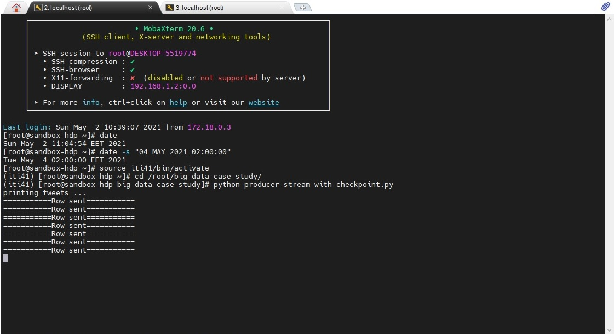
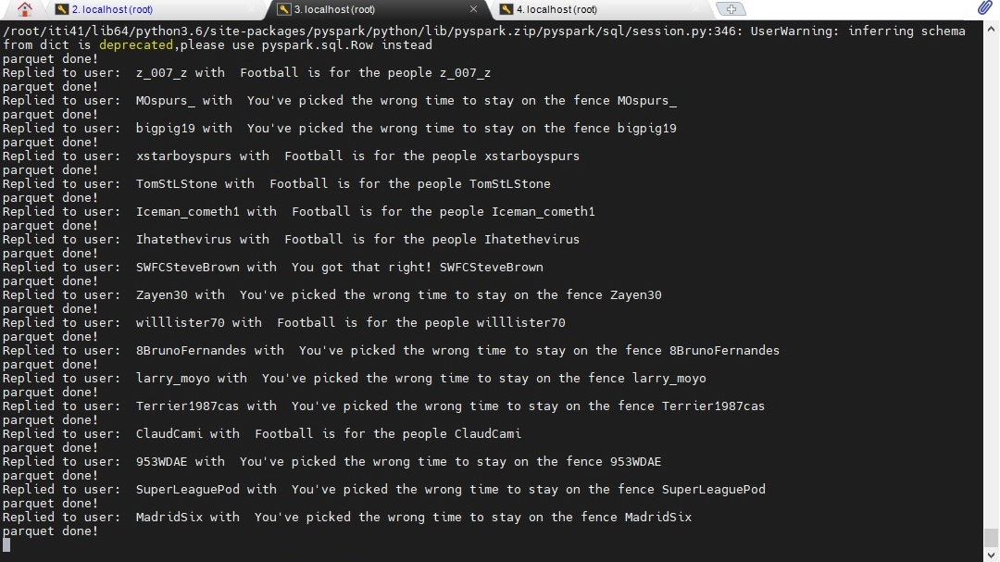
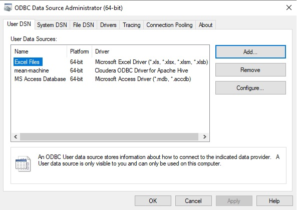
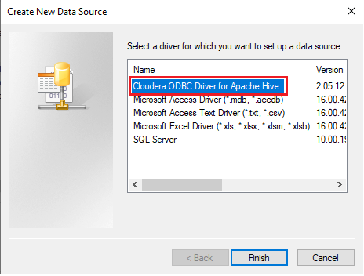
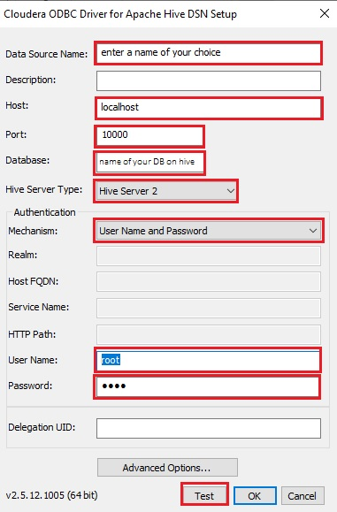
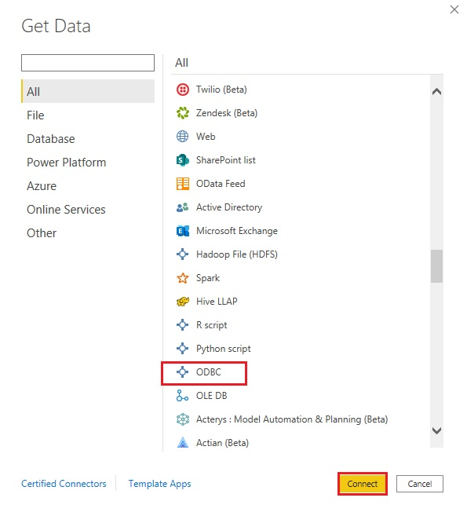
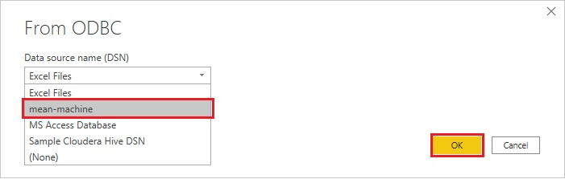

# Walkthrough
This is more of a description of the setup that I ran this project on, in addition to some prerequisites and a walkthrough on how to make your own setup and run the project.

### My PC's specs:
- Windows 10 x64
- RAM 16GB
- At least 70GB of free space

### What will you need?
- You will need to have a twitter developer account to create an app and use the Twitter API.
- You will need Oracle VirtualBox 6.0 (it's a stable version)
- You will need Hortonworks Data Platform (HDP) on Hortonworks Sandbox (either HDP 2.6.5 or HDP 3.0.1, the latter worked fine for me)
(You can download it for free from here https://www.cloudera.com/downloads/hortonworks-sandbox/hdp.html)
- You will need MobaXterm to access the virtual machine.
- You will need Microsoft Power Bi Desktop
- You will need the ODBC connector (attached with the project)

### Steps:

- Open Oracle VirtualBox and choose import. Then choose the image that you just downloaded (it should be a .ova file greater than 14GB)

- Once you import the virtual machine (the HDP) into the virtual box and start it up, it will start to extract the files.

- Once the files are extracted, go to MobaXterm and choose "Session" from the menu bar, then "SSH".

- In the 'Remote host" box enter "localhost", in the "username" box enter "root" and finally in the "port" box enter "2222" then click "Ok".

- It will then prompt you for a password. Type "hadoop". Once you're in, choose a memorable password.

- Now open your browser, go to "http://localhost:8080". The Ambari Server Web UI should open. In the username section type "raj_ops" and in the password section type "raj_ops" too.

- Once you're in, start the following services in the same order and leave the other services stopped:
	1. Zookeeper
	2. HDFS
	3. Yarn
	4. MapReduce
	5. Hive
	6. Spark2
	7. Kafka

- Once the services are up and running (it will take some time), go back to MobaXterm.

- I tried working my way around with the installed versions on HDP (Kafka 1.1.1 | Spark 2.3.1) but I kept getting version comptability errors [My code worked just fine on Windows and on a Centos7 virtual machine where I downloaded (Kafka_2.11-2.3.1 | Spark 2.4.7 | Scala 2.11), that's why I knew it's a version comptability issue]. Also the HDP comes with python2.7 as the main python, which is pain in the @ss.

- So, I made a virtual environment using python3.6 (which is already on HDP) and I installed what I needed in there:
	- python3.6 -m venv ./*name of your virtual environment*

- Activate the virtual environment:
	- source <name of your virtual environment>/bin/activate
- To check which python you're running, type "which python", it's supposed to be python3.6

- Upgrade your pip (saves you time later):
	- pip install --upgrade pip

- Download and install confluent-kafka module:
	- pip install confluent-kafka

- Download and install pyspark 2.4.6 (contains pyspark packages and will work just fine with you):
	- pip install pyspark==2.4.6

- Download and install the rest of the modules that you're going to use in your project:
	- pip install tweepy
	- pip install json_tricks
	- pip install jsonpickle
	- pip install kafka-python
	- pip install kafka-utils
	- pip install textblob

- Switch user to hdfs (you won't be prompted for a password):
	- su hdfs

- Create a directory under /user where you will dump your data. This also will be the directory of the Hive external table that we will make shortly:
	- hdfs dfs -mkdir /user/target-dir

- Change the permissions of the directory you just created to avoid permission errors later:
	- hdfs dfs -chmod 777 /user/target-dir

- Switch back to user root (you will be prompted for a password, enter the one you changed at the beginning or "hadoop" if you haven't changed it):
	- su root

- Start hive by simply typing "hive"

- Check that you can show and create databases:
	- show databases;
	- create database test;

- Inside the database you just created, create an external table and make its location to be the directory that you created 4 steps back. 
(This is a sample table, you could change the columns based on what you choose to retrieve from twitter).
	- use test;
	- create external table test.test_run (UserID STRING, Username STRING, Location STRING, Followers STRING, TweetID STRING, TweetText STRING, CreatedAT TIMESTAMP, Sentiment STRING, Replied STRING) STORED AS PARQUET LOCATION '/user/tweets-monitor/test-run';

- Check that the table is created
	- show tables;

- Exit hive and go back to the terminal

- Activate the virtual environment if you haven't activated it before:
	- source *name of your virtual environment*/bin/activate

- Change the date and time of your machine according to your timezone (mine happens to be Africa/Cairo) to avoid getting 401 errors from twitter:
	- sudo timedatectl set-timezone Africa/Cairo
	- date -s "02 MAY 2021 15:30:00"

- Now you are all set up to run the scripts (Don't forget to embed your own access tokens in the code).

- Run the consumer first and check it's up without errors:
	- spark-submit --packages org.apache.spark:spark-streaming-kafka-0-8_2.11:2.4.6 /path/to/script/consumer-pyspark.py

- Run the producer on a different terminal and watch the magic happens!
	- python /path/to/script/producer.py

- The producer and consumer should look something like this:

	
	
	

- To connect Power Bi to hive, download the ODBC (the one I attached is for the x64 Windows version, if you're running x32 you will have to download the x32 ODBC driver)

- In the start menu, type ODBC then choose "ODBC Data Sources"

- Choose "Add" then choose "Cloudera ODBC Driver for Apache Hive". Click "Finish"

	
	
	

- A new window will appear. In the Data Source box type "hive"

- In the host box type "localhost"

- In the Database box type "test"

- In the Hive Server Type dropdown menu choose "Hive Server2"

- In the Authentication Mechanism choose "Username and Password" and in the User Name box type "root" and in the Password box type your password (the one you changed when you first opened MobaXterm or "hadoop" if you haven't changed it).

- Test the connection and click "Ok". If the connection fails, in the Authentication Mechanism choose "Username" and in the User Name box type "hive". This should work.

	

- Open Power Bi Desktop.

- Choose "Get Data" then choose "ODBC". After that choose a data source "hive" and it will start previewing what you have in database "test".

	
	
	

- And voila! Happy Dashboards!

	

